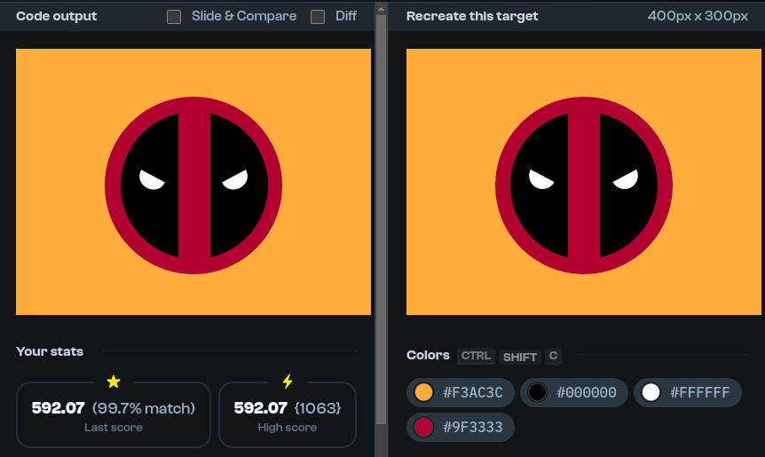

# CSS Battle Solutions

Welcome to the **CSS Battle Solutions** repository! 🎨

This repository contains my solutions to the challenges on [CSSBattle](https://cssbattle.dev/), a website where you can sharpen your CSS skills by solving fun and creative coding challenges.

## About CSSBattle

[CSSBattle](https://cssbattle.dev/) is a platform for CSS lovers to challenge their skills by replicating target images with the least possible CSS code. The goal is to match the target image as closely as possible using only HTML and CSS.

## Repository Structure

Each battle's solution is stored in a separate folder named after the battle. Within each folder, you will find:

- **index.html**: Contains the HTML and CSS code for the challenge.
- **screenshot.png**: A screenshot of my solution.

## Screenshots
#### Deadpool

